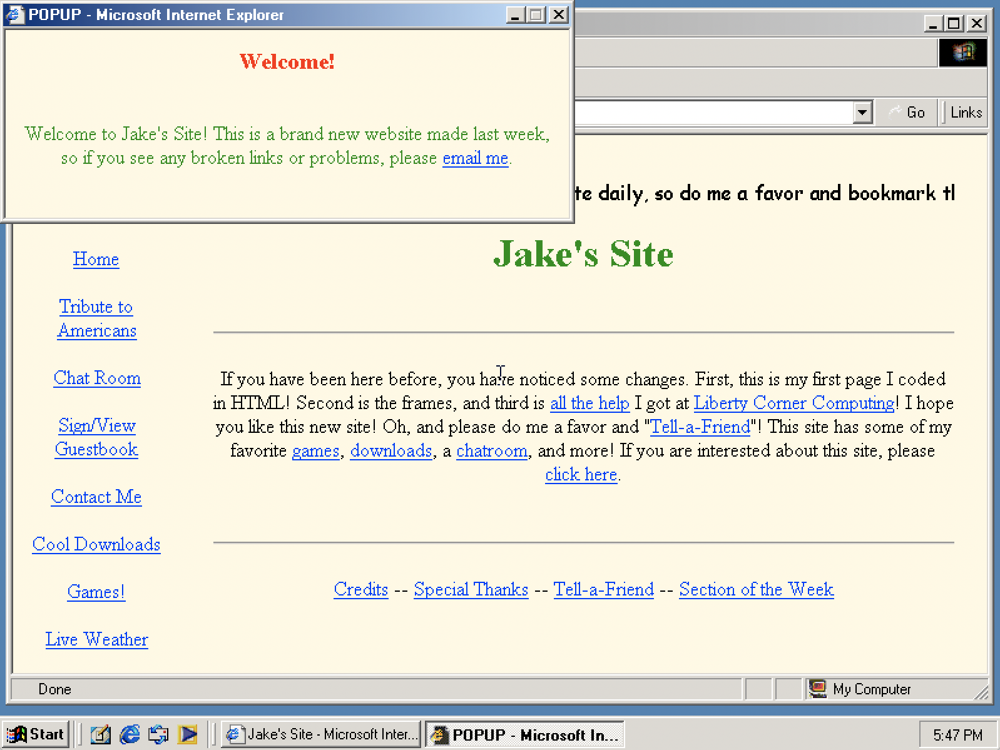

# 💾 [Y2K Sandbox](https://y2k.jarv.is/)  

Nostalgic time machine powered by on-demand Windows Me® VMs, [my first website](https://github.com/jakejarvis/my-first-website), and quarantine boredom. 📟

This branch contains the backend scripts and Windows Me container. The frontend website code is in [the `gh-pages` branch](https://github.com/jakejarvis/y2k/tree/gh-pages).

[**📝 Read the blog post here.**](https://jarv.is/notes/y2k-land/)

## Requirements

- Docker
- [QEMU](https://www.qemu.org/) (target i386)
- [websocketd](https://github.com/joewalnes/websocketd)
- [noVNC](https://github.com/novnc/noVNC)
- [Cloudflare Workers](https://workers.cloudflare.com/) & [Argo Tunnel](https://www.cloudflare.com/products/argo-tunnel/)
- [Microsoft Bob](https://en.wikipedia.org/wiki/Microsoft_Bob)

## Inspired By

- [charlie.bz](https://charlie.bz/)
- [benjojo.co.uk](https://benjojo.co.uk/)
- [Microsoft Bob](https://en.wikipedia.org/wiki/Microsoft_Bob)

## To-Do

- [x] **Commit backend scripts**
- [x] Sync user's mouse cursor/movements with VM
- [x] Error messages: no websockets, server down, etc.
- [ ] Usage limits
- [ ] Responsive browser sizing

## License

This project is distributed under the [MIT license](LICENSE.md).
